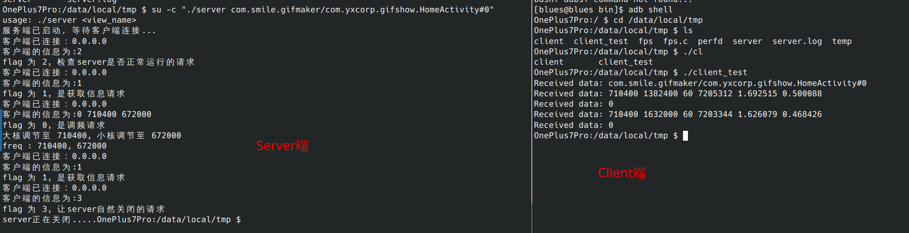

## Native层二进制文件说明


该文档为二进制程序的说明，即图中的左边部分，二进制程序(Server)的说明。

### 基本思路

在Native层使用C++编写信息收集部分的代码替代使用exec函数和cat指令获取信息的方法。

1. 大小核频率：使用fopen打开```/sys/devices/system/cpu/cpufreq/policy*/scaling_cur_freq```获取当前CPU频率。
2. 大小核利用率：使用fopen打开```/proc/stat```然后进行运算得到大小核利用率。（利用率最大值为4）
2. 内存：使用fopen打开```/proc/meminfo```获得当前可用频率。
2. 帧率：通过SurfaceFlinger获得。因为该部分无法直接通过读取文件或使用安卓直接提供的接口实现，只能通过dumpsys SurfaceFligner --latency view 获得近期渲染的帧的数据再分析获得当前帧率。在后台开启一个线程不断收集近期渲染帧的数据，在需要获取FPS时，分析帧数据，并得到当前帧率。

在Native层使用C++编写设置频率的代码，替代使用exec函数和echo指令设置CPU频率的方案。

1. 大小核频率：用fopen打开```/sys/devices/system/cpu/cpufreq/policy*/scaling_setspeed```并且写入预期的频率。

（注：在写入scaling_setspeed之前，需要先将大小集群的governor设置为userspace, 否则写入会失败或写入无效，因为governor的设置并非由这个二进制程序实现，故单独测试时，请先将governor设置为userspace）


### 编译方法

首先需要保证您下载了NDK软件包。下载地址如下。

https://developer.android.com/ndk/downloads?hl=zh-cn

为方便起见，此处编写了编译脚本compile.sh。内容如下所示

```bash
NDK=/home/blues/Desktop/android-ndk-r25c/toolchains/llvm/prebuilt/linux-x86_64/bin/aarch64-linux-android30-clang++ 
$NDK $1 fps.cpp -static-libstdc++ -o $2
adb push $2 /data/local/tmp
```

注意将上面的NDK路径设置为您的计算机中的NDK路径并选择**正确的，符合您设备软硬件要求的编译器**。因为测试的设备为Google Pixel3且api 版本为30, 故为选择```aarch64-linux-android30-clang++``` 为编译器。

添加```-static-libstdc++```是因为部分代码使用C++编写，需要静态引入C++的依赖库，否则能编译但是运行时可能报错。

然后将编译后得到的二进制文件push到设备的/data/local/tmp下，因为该路径下具备可写可执行权限，也可替换为其他合适的位置。


然后```bash compile.sh server.cpp server```即可编译文件并将其推送至设备上。


### 权限要求

因为涉及一些系统文件的读写，所以需要有root权限才能正常执行该二进制程序。

执行方法为在adb shell中，```su -c "/data/local/tmp/server <view_name>"```

（注：运行时请注意应用中的view需要与前台应用的view对应，否则无法正常启动server）


### SOCKET通信要求

运行完成后，server会在127.0.0.1:8888处监听socket请求。

client 合法的socket请求为以下两类。

```bash
0 big_freq little_freq
1
2
3
```

因为目前还在demo阶段，并没有做纠错，检查等操作，**不合法的socket可能导致程序崩溃。**

```0 big_freq little_freq```是标志位为0, 表示此处需要设置频率， 然后紧跟空格分隔预期的大小核频率。server若设置成功则会返回0, 否则返回-1。

```1```是标志位为1, 表示此处需要获取设备信息，server将会以空格间隔返回设备的信息。

```2```是标志位为2, 用于service和 server获取server当前是否正常，server若正常，会返回client当前server的view.

```3```是标志位为3, 用于让service关闭server


### Example说明

此处提供一个client说明server如何使用。即目录中的client_test.cpp。

该程序向server发送一次获取信息请求，然后向server发送一次设置频率请求，最后向server发送一次获取信息请求。

```c++
int main() {
    std::string serverIP = "127.0.0.1";
    int port = 8888;

    // 检查当前的server的view
    std::string message1 = "2";
    std::string receivedData = sendAndReceiveSocket(message1, serverIP, port);
    std::cout << "Received data: " << receivedData << std::endl;
    sleep(1);
 

    // 收集当前设备的信息
    message1 = "1";
    receivedData = sendAndReceiveSocket(message1, serverIP, port);
    std::cout << "Received data: " << receivedData << std::endl;
    sleep(1);
     
    // 设置频率
    std::string message2 = "0 710400 672000";
    receivedData = sendAndReceiveSocket(message2, serverIP, port);
    std::cout << "Received data: " << receivedData << std::endl;
    sleep(1);

    // 再收集设备的信息
    std::string message3 = "1";
    receivedData = sendAndReceiveSocket(message3, serverIP, port);
    std::cout << "Received data: " << receivedData << std::endl;
    sleep(1);

    // 关闭server
    message1 = "3";
    receivedData = sendAndReceiveSocket(message1, serverIP, port);
    std::cout << "Received data: " << receivedData << std::endl;
    sleep(1);
 

    return 0;
}

```

使用编译server相同的方法编译client_test.cpp， 并且使用相同的方法运行client_test。

（注：运行client_test前请不要忘记将governor设置为userspace，设置命令如下， 都需要以root权限运行）

```bash
echo "userspace" >  /sys/devices/system/cpu/cpufreq/policy0/scaling_governor 
echo "userspace" >  /sys/devices/system/cpu/cpufreq/policy4/scaling_governor 
```

然后运行client_test程序即可。

可以得到输出如下所示。




### 其他说明

#### TIME_WAIT

若发现关闭server后再打开server时出现报错，该报错是因为socket关闭后会有一段时间处于TIME_WAIT状态，需要等待1min左右再运行server。

```bash
bind failed: Address already in use
```

