## native层测试

### 编译方法

```bash
NDK=/home/blues/Desktop/android-ndk-r25c/toolchains/llvm/prebuilt/linux-x86_64/bin/aarch64-linux-android30-clang++ 
$NDK $1 fps.cpp -static-libstdc++ -o $2
adb push $2 /data/local/tmp
```

其中NDK表示交叉编译的编译器，因为api是30, 所以选择这个编译器。

-static-libstdc++ 必须要有，不知道为什么，在pixel3中，链接动态的shared_libstdc++会报错，所以此处选择静态链接。


### 常用命令

```bash
am start-foreground-service -n "com.example.networktrans/com.example.networktrans.MyService"
am stop-service -n "com.example.networktrans/com.example.networktrans.MyService"

am start-foreground-service -n "com.example.anomalyapp/com.example.anomalyapp.ComputeService"
```


### 时间开销

#### java实现

之前使用java的runtime.getruntime.exec获取信息的时间开销如下图所示

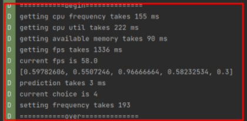

获取cpu频率155ms, 获取cpu利用率222ms,获取可用内存90ms, 获取fps1336ms。

总时长达到了1803ms。 除去获取fps时的sleep 1s, 总开销也达到了803ms。接近一秒。

#### native实现

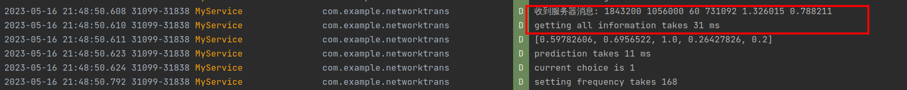

获取所有的信息的总时间开销为34ms。

甚至有时候只需要10+ms。


但是在实测时发现，这部分并不稳定。

在手机发热时，或者后台添加cpu任务时，时间会显著上升，达到100+ms。但是又会很快回到100以下。观察了很长时间，在比较热以及有cpu负载时。最最高达到了320ms+。

**此处有问题** 发现随着服务运行的时间越来越长，服务自身的性能会越来越差。暂时不知道是什么原因，每次重启服务， 则获取信息的时间都在20ms以下，随着服务运行时间的增加，时间开销越来越大。

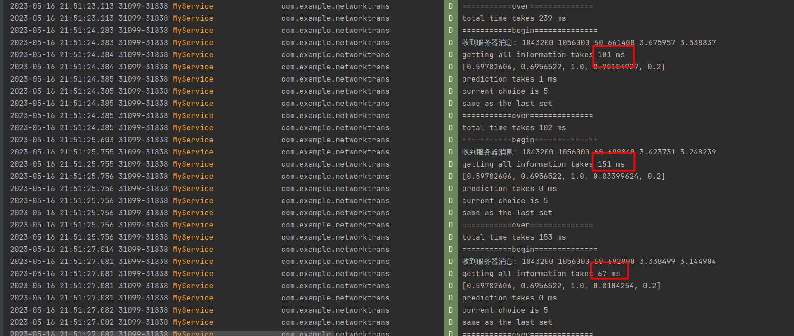

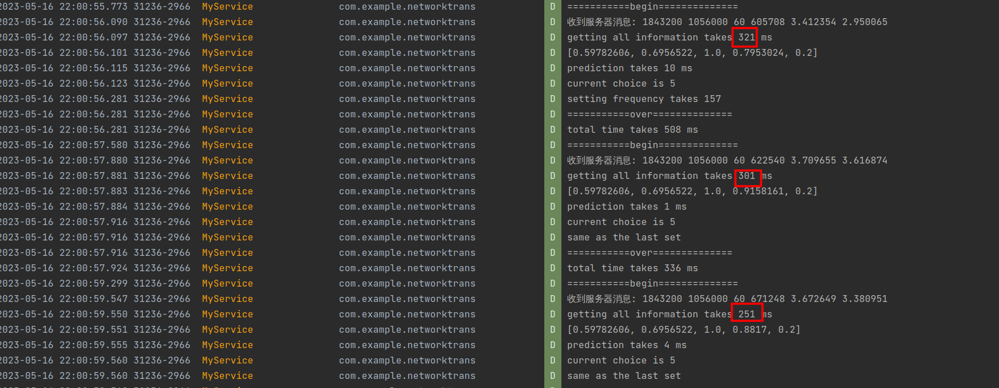

### 资源开销

因为其实java的应用程序的开销并不是实际的开销，因为其实exec的开销没有被计入到应用程序中，所以此处仅说明native的开销。

#### top命令查看cpu和内存开销

**注：此处因为获取fps仍然是使用dumpsys外部命令实现的，所以这部分开销在top中仍然无法体现出来，但是相比于app来说，已经更加接近真实了**


因为是cs架构，获取信息的二进制程序在平时是被阻塞的，所以他的cpu使用率和内存开销都与访问该服务的次数有非常强的相关性。

在无访问时，CPU开销在1.6%，内存占用很小。

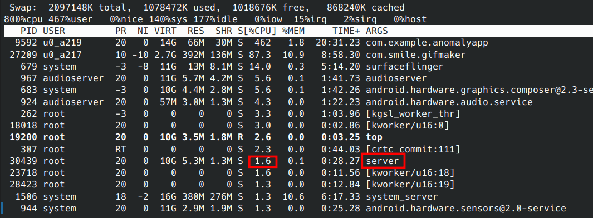


在app以最小的调频间隔访问时（即无sleep,只要一调完频就立刻继续采样）。cpu开销达到了7%-8%。这部分比较奇怪，有时又会达到比较高，10%以上的cpu利用率。我觉得和设备当时的状态有很大关系。

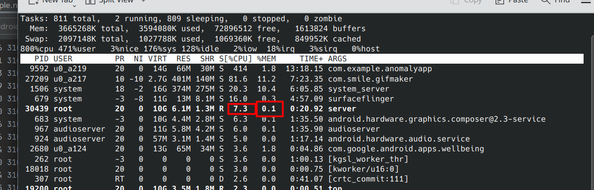


#### profiler查看的整机cpu开销

图中的cpu开销分为三个阶段，

第一部分为开启了实时使用adb监测帧率和频率，可以看到基本处于完全的满载

第二部分为关闭了实时监测，但是收集信息的服务和app的service仍然开启

第三部分为关闭了app的service

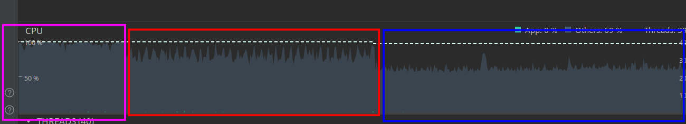


图中的开销分为两个阶段

第一部分中其实包含了，未开启任何服务与开启了收集信息的二进制服务，但是其实几乎看不出什么区别。

第二部分，开启了app的service, 整体cpu利用率上升了。

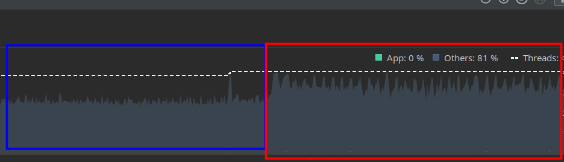


可能会觉得为什么空闲时也如此高的利用率，我也很奇怪，然后我发现，是忘记关cpu负载了。。。。


--------

关了cpu负载再测一次。

左边为完全空闲时，而后开启了收集信息的service,因为没人请求，其实看不出太大的区别。

右边为开启app的service后的cpu负载。

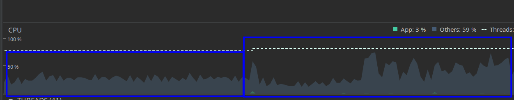


在以往的文档里找到了之前的代码的cpu整机负载。可以看到下图中的高峰的峰值更高，而上图中的则更低。说明确实减少了很多开销。

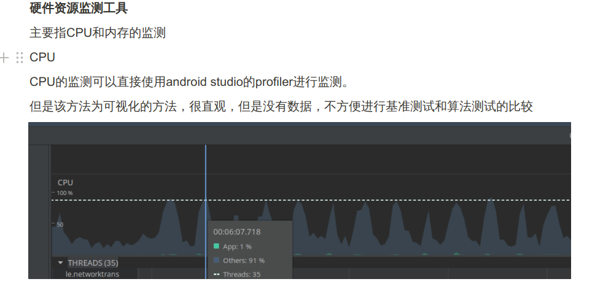


### 结论

二进制的方式能够显著降低cpu开销，时间开销，内存开销因不好测试，不知道详细比较，但是占用很小。


### 还需解决的问题

**1.异常处理，服务可能会因为异常而挂掉**

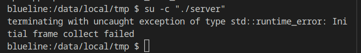


**2.比较明显的时间积累的问题**

发现随着服务运行的时间越来越长，服务自身的性能会越来越差。暂时不知道是什么原因，也不知道到底存不存在这个问题，每次重启服务， 则获取信息的时间都在20ms以下，随着服务运行时间的增加，时间开销越来越大。

发现存在很多对这个服务的访问处于TIME_WAIT状态，暂时还不知道是什么原因，可能有影响。

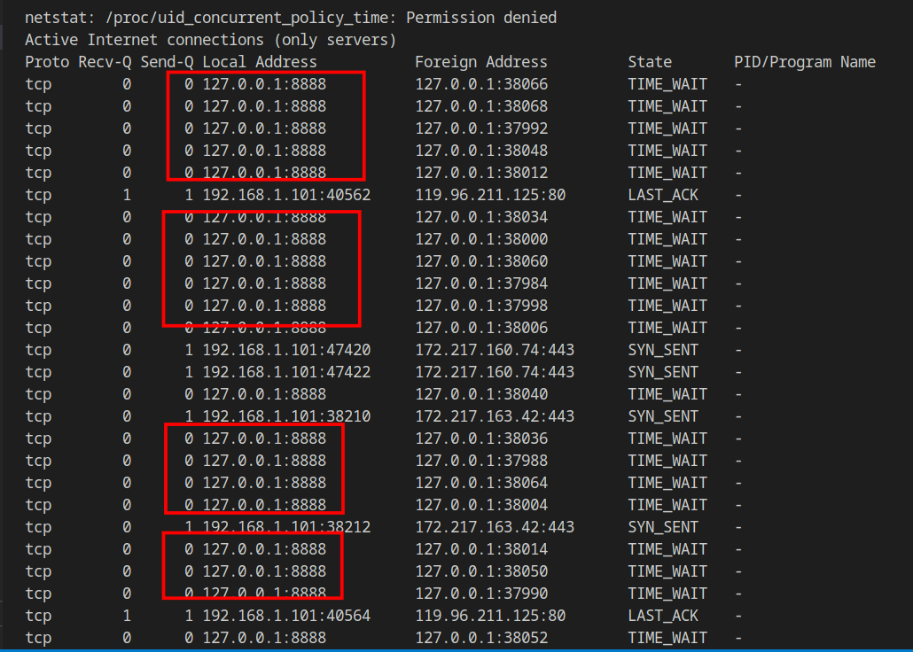

**3.一个之前在app中也存在的问题，帧率获取与外部不同。**

左边是一个实时帧率，cpu频率展示的图，右边是运行时的日志输出。

我在手机上人为的上下滑动，会导致帧率的波动。两者都能检测出来有波动。但是在两个阶段，两者得到的fps不是很一致。

之前在app上存在这种问题，但是现在更明显了，也可能是我的c语言写的有问题。。。。

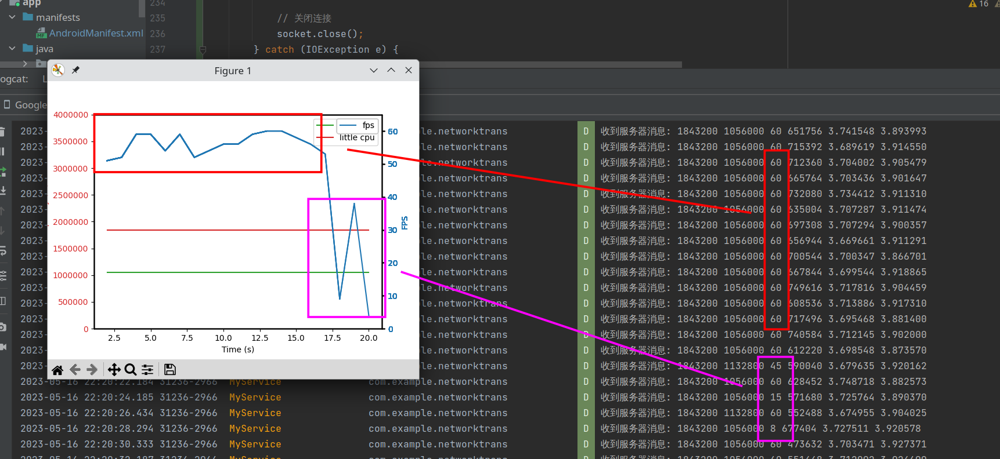

**4.将cpu频率设置也尽可能解耦到这个二进制文件中去**

cpu设置需要100-200ms的时间开销，应该也有较高的cpu开销。下一步要将cpu频率设置也放到二进制文件中。app与二进制文件通过socket通信。

