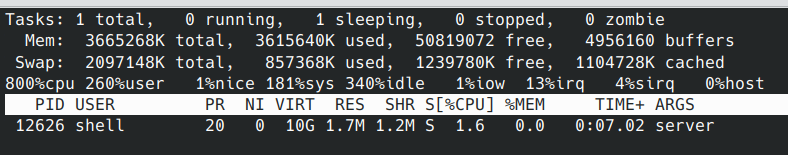
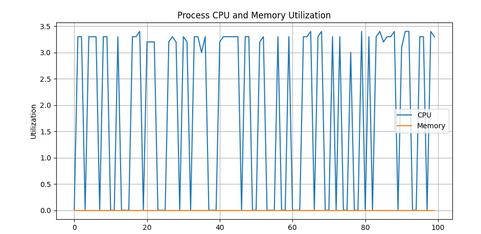
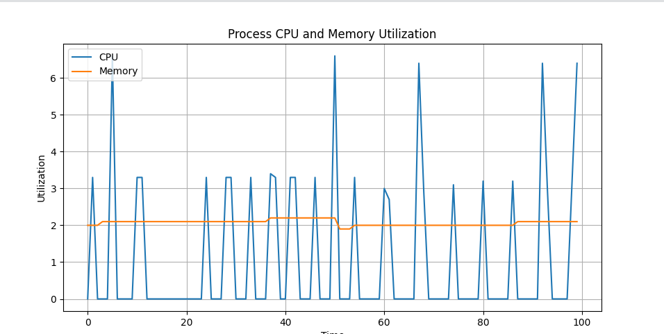
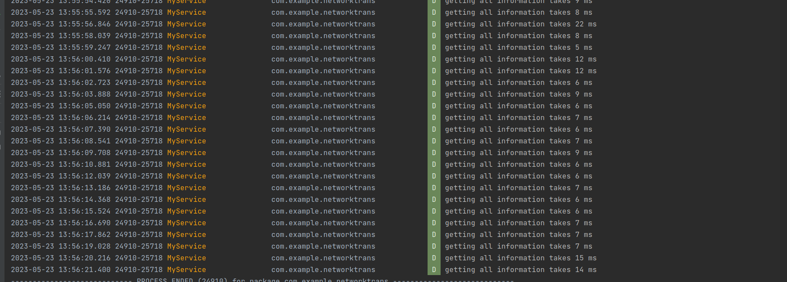
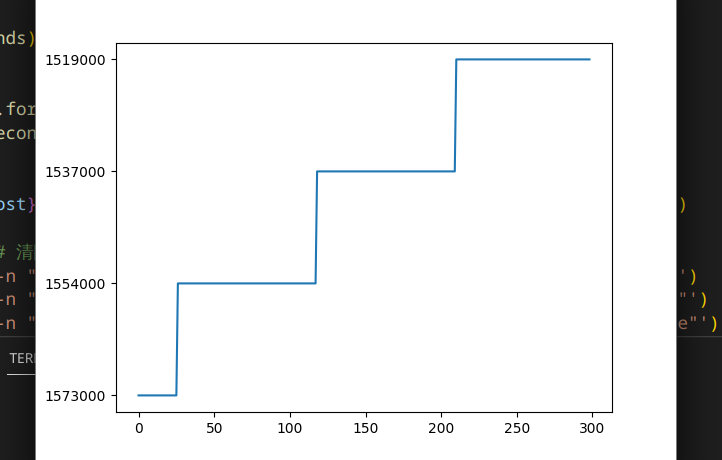

# native层编写2

## 常用命令


```bash
nohup /data/local/tmp/server > /data/local/tmp/server.log 2>&1 &

am start-foreground-service -n "com.example.networktrans/com.example.networktrans.MyService"
am stop-service -n "com.example.networktrans/com.example.networktrans.MyService"
am start-foreground-service -n "com.example.anomalyapp/com.example.anomalyapp.ComputeService"
```

## 解决的问题

1.随着时间增加导致的开销增加问题

2.将set freq也集成到了service中


## 开销

### server的cpu和内存开销

cpu开销，正常运行时在0-4%



使用可视化的方式，记录了一段时间内的cpu利用率和内存开销。



基本在3.5和0之间波动，然后内存开销基本为0。


### client的CPU和内存开销

使用可视化的方式，查看一段时间内的app的内存和cpu利用率的开销。

cpu利用率大多数时候在3%以上，有时达到6%以上。内存开销为2%左右。



### 时间开销

#### 获取信息的时间开销

非常小，基本在20ms以下，偶尔会达到60ms，（非常少见， 不知道原因）

不会再因为运行时间而导致时间开销增大。



#### 设置频率的时间开销


## 问题

### fopen写文件的权限问题

可能是之前测试的时候没有使用su运行导致的错误印象，使用chmod给到644权限后，然后使用su运行即可使用fopen进行文件的写。

### 电源的采样问题



每隔一秒取数据，然后绘制图像，可以得到如上所示的阶梯，说明采样时间是固定的。

29,  121，213

每个平台的长度都是92s。所以为了测试的准确，在测试前，使其在一个刚采样时开始测试，然后到下一次采样时结束整个测试。
