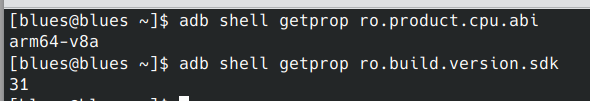
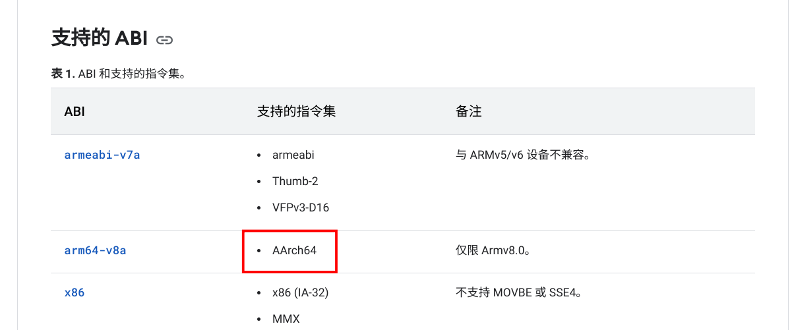
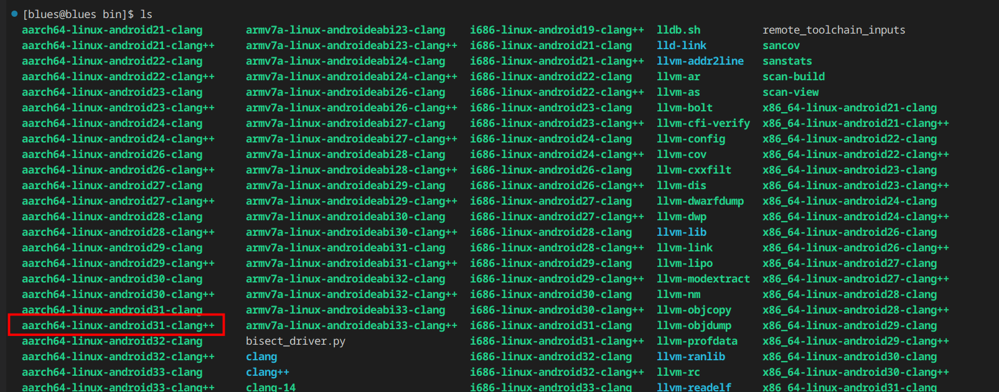
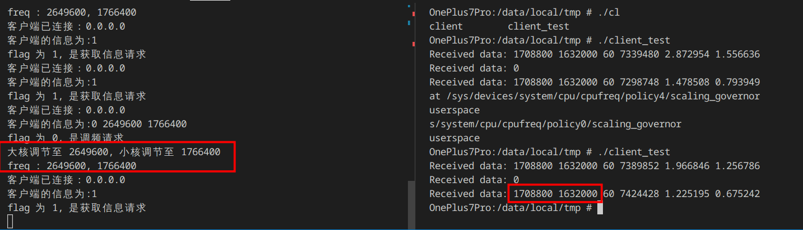
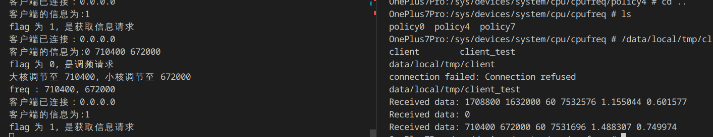
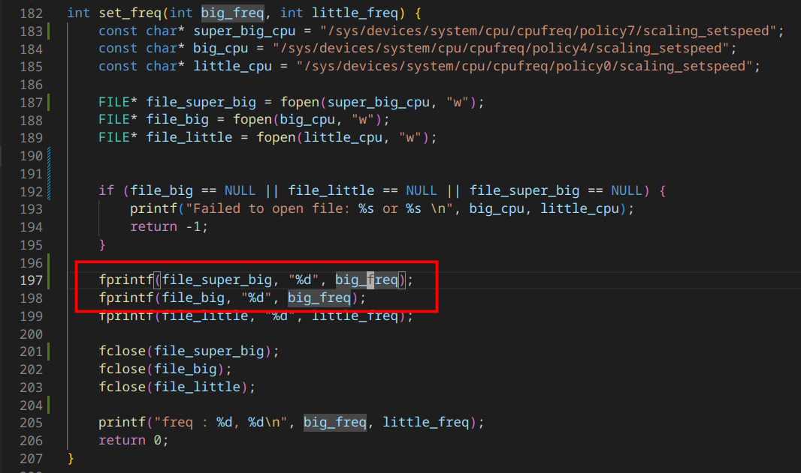

# 移植到一加7pro
## Native层修改
### 编译器选择

1. 首先获取设备的架构

   ```bash
   adb shell getprop ro.product.cpu.abi
   ```

2. 获取设备的API版本

   ```bash
   adb shell getprop ro.build.version.sdk
   ```



查找资料得到，对于arm64-v8a架构支持的指令集为AArch64。




所以搭载color 12的一加7pro需要使用的编译器为



```bash
aarch64-linux-android31-clang++
```

在compile.sh中，修改编译器为对应版本即可。

### 测试结果

即使在设置了调频器为userspace后，仍然不能够成功设置频率。



经过测试发现，是因为设置的频率超过了scaling_max_freq。不能成功设置为对应频率。将其设置为对应范围内的频率即可。



### 超大核适配

因为模型的输出是仅包含大小核的频率，所以此处需要微调频率设置部分，将超大核的频率设置为和大核相同。




## APP的Service修改

因为有native层的二进制文件处理不同硬件和不同架构的区别，所以APP的Serivice几乎不用太多的变化。

目前已经尽量精简和修改了app的代码，使其具备更好的可读性。

解耦了配置文件，方便在不同的设备上迁移。


需要修改两个位置：

1. 修改assets中的模型为对应机型的模型。

   首先需要转h5为tensorflow lite格式。

   如何转换具体见h5_to_tflite压缩包中文档


2. 修改config.java中的一些配置

   修改可选的大小核频率为对应机型的大小核频率。

   修改view为将要测试的前台应用的view。
